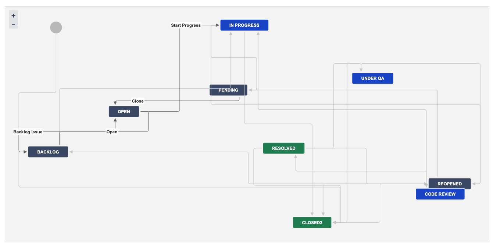
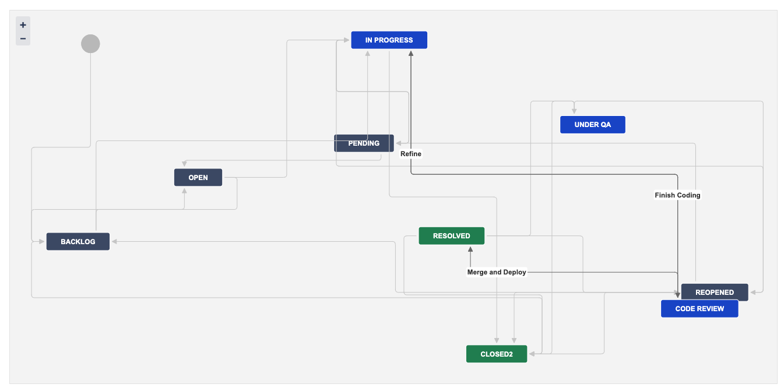

# jira-action

GitHub Action 用于将 [Jira][1] 集成到您的 CI/CD 流程中。它允许您根据 GitHub 仓库中的事件（例如创建分支、推送提交、打开拉取请求或合并拉取请求）自动转换 Jira 问题。这有助于通过保持您的 Jira 问题与代码库中的最新变更同步来简化您的开发工作流程。

[1]: https://www.atlassian.com/software/jira/data-center

[English](./README.md) | [繁體中文](./README.zh-tw.md) | 简体中文

## 动机

由于目前在线上没有官方的 Jira API 与 GitHub Action 的整合方案，并且考虑到 Jira 现在有 [Cloud][5] 和 [Data Center][6] 版本，且它们的 API 实现方式不同，本项目将初步专注于 [Data Center][6] 版本。这将使购买企业版的朋友能够通过 CI/CD 自动整合 Jira 问题状态的调整。

本项目的目标是提供一个简单的方法，将 Jira 与 GitHub 或 Gitea Actions 整合，适用于 Jira Data Center。

[5]: https://developer.atlassian.com/cloud/jira/platform/
[6]: https://developer.atlassian.com/server/jira/platform/

## 参数

| 名称          | 描述                                                               | 默认值                      |
| ------------- | ------------------------------------------------------------------ | --------------------------- |
| base_url      | Jira 实例的基本 URL。                                              |                             |
| insecure      | 允许不安全的 SSL 连接。                                            |                             |
| username      | 用于基本身份验证的用户名。仅推荐用于脚本或机器人。                 |                             |
| password      | 用于基本身份验证的密码。仅推荐用于脚本或机器人。                   |                             |
| token         | 用于身份验证的个人访问令牌 (PAT)。此方法使用与令牌关联的用户账户。 |                             |
| ref           | 触发工作流程运行的分支或标签的完整引用。                           |                             |
| issue_pattern | 匹配字母数字问题的模式，例如 ABC-1234。                            | `([A-Z]{1,10}-[1-9][0-9]*)` |
| transition    | 将问题移动到特定状态，例如完成、进行中。                           |                             |
| resolution    | 设置问题的解决方案，例如完成、修复。                               |                             |
| assignee      | 将问题分配给特定用户。                                             |                             |
| comment       | 要添加到问题的评论。                                               |                             |

## 示例

### 当分支被创建时将问题转换为「进行中」

当分支被创建时将 Jira 问题转换为「进行中」。



```yaml
name: jira integration

on:
  create:
    types:
      - branch

jobs:
  jira-branch:
    runs-on: ubuntu-latest
    if: github.event.ref_type == 'branch'
    name: create new branch
    steps:
      - name: transition to in progress on branch event
        uses: appleboy/jira-action@v0.2.0
        with:
          base_url: https://xxxxx.com
          insecure: true
          token: ${{ secrets.JIRA_TOKEN }}
          ref: ${{ github.ref_name }}
          transition: "Start Progress"
          assignee: ${{ github.actor }}
```

### 当提交被推送时将问题转换为「进行中」

当提交被推送时将问题转换为「进行中」


```yaml
name: jira integration

on:
  push:
    branches:
      - "*"

jobs:
  jira-push-event:
    runs-on: ubuntu-latest
    if: github.event_name == 'push'
    name: transition to in progress on push event
    steps:
      - name: transition to in progress on push event
        uses: appleboy/jira-action@v0.2.0
        with:
          base_url: https://xxxxx.com
          insecure: true
          token: ${{ secrets.JIRA_TOKEN }}
          ref: ${{ github.event.head_commit.message }}
          transition: "Start Progress"
          assignee: ${{ github.event.head_commit.author.username }}
          comment: |
            🧑‍💻 [~${{ github.event.pusher.username }}] push code to repository {color:#ff8b00}*${{ github.repository }}*{color} {color:#00875A}*${{ github.ref }}*{color} branch.

            See the detailed information from [commit link|${{ github.event.head_commit.url }}].

            ${{ github.event.head_commit.message }}
```

### 当拉取请求被打开时将问题转换为「审查中」



当拉取请求被打开时将问题转换为「审查中」

```yaml
on:
  pull_request_target:
    types: [opened, closed]

jobs:
  open-pull-request:
    runs-on: ubuntu-latest
    if: github.event_name == 'pull_request_target' && github.event.action == 'opened'
    name: transition to in review when pull request is created
    steps:
      - name: transition to in review when pull request is created
        uses: appleboy/jira-action@v0.2.0
        with:
          base_url: https://xxxxx.com
          insecure: true
          token: ${{ secrets.JIRA_TOKEN }}
          ref: ${{ github.event.pull_request.title }}
          transition: "Finish Coding"
          comment: |
            🔧 [~${{ github.event.pull_request.user.login }}] {color:#00875A}*${{ github.event.pull_request.state }}*{color} pull request from repository {color:#ff8b00}*${{ github.repository }}*{color} {color:#00875A}*${{ github.event.pull_request.head.ref }}*{color} to {color:#00875A}*${{ github.event.pull_request.base.ref }}*{color}.

            See the detailed information from [pull request link|${{ github.event.pull_request.html_url }}].

            Pull request: *${{ github.event.pull_request.title }}*
```

### 当拉取请求被合并时将问题转换为「已解决」


当拉取请求被合并时将问题转换为「已解决」

```yaml
name: jira integration

on:
  pull_request:
    types:
      - closed

jobs:
  jira-merge-request:
    runs-on: ubuntu-latest
    if: ${{ github.event.pull_request.merged }}
    name: transition to Merge and Deploy
    steps:
      - name: transition to in review
        uses: appleboy/jira-action@v0.2.0
        with:
          base_url: https://xxxxx.com
          insecure: true
          token: ${{ secrets.JIRA_TOKEN }}
          ref: ${{ github.event.pull_request.title }}
          transition: "Merge and Deploy"
          resolution: "Fixed"
          comment: |
            🔀 [~${{ github.event.pull_request.merged_by.login }}] {color:#00875A}*merged*{color} pull request from repository {color:#ff8b00}*${{ github.repository }}*{color} {color:#00875A}*${{ github.event.pull_request.head.ref }}*{color} branch to {color:#00875A}*${{ github.event.pull_request.base.ref }}*{color} branch.

            See the detailed information from [pull request link|${{ github.event.pull_request.html_url }}].

            Pull request: *${{ github.event.pull_request.title }}*
```
