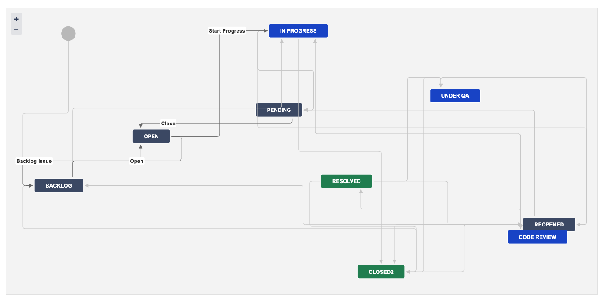
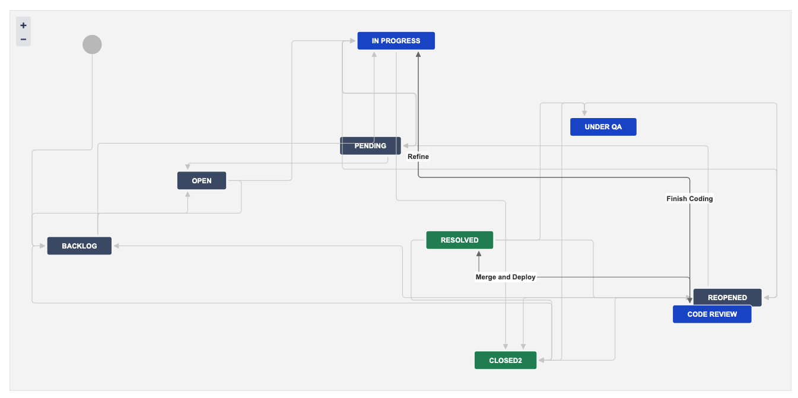

# jira-action

[](https://github.com/appleboy/jira-action/actions/workflows/trivy.yml)

> **注意：**此 Action 目前僅支援 **Jira Data Center**，暫不支援 Jira Cloud。

GitHub Action 用於將 [Jira][1] 整合到您的 CI/CD 流程中。它允許您根據 GitHub 儲存庫中的事件（例如創建分支、推送提交、打開拉取請求或合併拉取請求）自動轉換 Jira 問題。這有助於通過保持您的 Jira 問題與代碼庫中的最新變更同步來簡化您的開發工作流程。

[1]: https://www.atlassian.com/software/jira/data-center

[English](./README.md) | 繁體中文 | [简体中文](./README.zh-cn.md)

- [Integrating Gitea with Jira Software Development Workflow][01]
- [Gitea 與 Jira 軟體開發流程整合][02]

[01]: https://blog.wu-boy.com/2025/03/gitea-integrate-with-jira-issue-tracking-flow-en/
[02]: https://blog.wu-boy.com/2025/03/gitea-integrate-with-jira-issue-tracking-flow-zh-tw/

## 動機

由於目前在線上沒有官方的 Jira API 與 GitHub Action 的整合方案，並且考慮到 Jira 現在有 [Cloud][5] 和 [Data Center][6] 版本，且它們的 API 實現方式不同，本專案將初步專注於 [Data Center][6] 版本。這將使購買企業版的朋友能夠通過 CI/CD 自動整合 Jira 問題狀態的調整。

本專案的目標是提供一個簡單的方法，將 Jira 與 GitHub 或 Gitea Actions 整合，適用於 Jira Data Center。

[5]: https://developer.atlassian.com/cloud/jira/platform/
[6]: https://developer.atlassian.com/server/jira/platform/

## 參數

| 名稱          | 描述                                                               | 預設值                      |
| ------------- | ------------------------------------------------------------------ | --------------------------- |
| base_url      | Jira 實例的基本 URL。                                              |                             |
| insecure      | 允許不安全的 SSL 連接。                                            |                             |
| username      | 用於基本身份驗證的用戶名。僅建議用於腳本或機器人。                 |                             |
| password      | 用於基本身份驗證的密碼。僅建議用於腳本或機器人。                   |                             |
| token         | 用於身份驗證的個人訪問令牌 (PAT)。此方法使用與令牌關聯的用戶帳戶。 |                             |
| ref           | 觸發工作流程運行的分支或標籤的完整引用。                           |                             |
| issue_pattern | 匹配字母數字問題的模式，例如 ABC-1234。                            | `([A-Z]{1,10}-[1-9][0-9]*)` |
| transition    | 將問題移動到特定狀態，例如完成、進行中。                           |                             |
| resolution    | 設置問題的解決方案，例如完成、修復。                               |                             |
| assignee      | 將問題分配給特定用戶。                                             |                             |
| comment       | 要添加到問題的評論。                                               |                             |
| markdown      | 將 Markdown 格式轉換為 Jira 格式。                                 | `false`                     |

## 範例

### 當分支被建立時將問題轉換為「進行中」

當分支被建立時將 Jira 問題轉換為「進行中」。



```yaml
name: jira integration

on:
  create:
    types:
      - branch

jobs:
  jira-branch:
    runs-on: ubuntu-latest
    if: github.event.ref_type == 'branch'
    name: create new branch
    steps:
      - name: transition to in progress on branch event
        uses: appleboy/jira-action@v0.2.0
        with:
          base_url: https://xxxxx.com
          insecure: true
          token: ${{ secrets.JIRA_TOKEN }}
          ref: ${{ github.ref_name }}
          transition: "Start Progress"
          assignee: ${{ github.actor }}
```

### 當提交被推送時將問題轉換為「進行中」

當提交被推送時將問題轉換為「進行中」


```yaml
name: jira integration

on:
  push:
    branches:
      - "*"

jobs:
  jira-push-event:
    runs-on: ubuntu-latest
    if: github.event_name == 'push'
    name: transition to in progress on push event
    steps:
      - name: transition to in progress on push event
        uses: appleboy/jira-action@v0.2.0
        with:
          base_url: https://xxxxx.com
          insecure: true
          token: ${{ secrets.JIRA_TOKEN }}
          ref: ${{ github.event.head_commit.message }}
          transition: "Start Progress"
          assignee: ${{ github.event.head_commit.author.username }}
          comment: |
            🧑‍💻 [~${{ github.event.pusher.username }}] push code to repository {color:#ff8b00}*${{ github.repository }}*{color} {color:#00875A}*${{ github.ref }}*{color} branch.

            See the detailed information from [commit link|${{ github.event.head_commit.url }}].

            ${{ github.event.head_commit.message }}
```

### 當拉取請求被打開時將問題轉換為「審查中」



當拉取請求被打開時將問題轉換為「審查中」

```yaml
on:
  pull_request_target:
    types: [opened, closed]

jobs:
  open-pull-request:
    runs-on: ubuntu-latest
    if: github.event_name == 'pull_request_target' && github.event.action == 'opened'
    name: transition to in review when pull request is created
    steps:
      - name: transition to in review when pull request is created
        uses: appleboy/jira-action@v0.2.0
        with:
          base_url: https://xxxxx.com
          insecure: true
          token: ${{ secrets.JIRA_TOKEN }}
          ref: ${{ github.event.pull_request.title }}
          transition: "Finish Coding"
          comment: |
            🔧 [~${{ github.event.pull_request.user.login }}] {color:#00875A}*${{ github.event.pull_request.state }}*{color} pull request from repository {color:#ff8b00}*${{ github.repository }}*{color} {color:#00875A}*${{ github.event.pull_request.head.ref }}*{color} to {color:#00875A}*${{ github.event.pull_request.base.ref }}*{color}.

            See the detailed information from [pull request link|${{ github.event.pull_request.html_url }}].

            Pull request: *${{ github.event.pull_request.title }}*
```

### 當拉取請求被合併時將問題轉換為「已解決」


當拉取請求被合併時將問題轉換為「已解決」

```yaml
name: jira integration

on:
  pull_request:
    types:
      - closed

jobs:
  jira-merge-request:
    runs-on: ubuntu-latest
    if: ${{ github.event.pull_request.merged }}
    name: transition to Merge and Deploy
    steps:
      - name: transition to in review
        uses: appleboy/jira-action@v0.2.0
        with:
          base_url: https://xxxxx.com
          insecure: true
          token: ${{ secrets.JIRA_TOKEN }}
          ref: ${{ github.event.pull_request.title }}
          transition: "Merge and Deploy"
          resolution: "Fixed"
          comment: |
            🔀 [~${{ github.event.pull_request.merged_by.login }}] {color:#00875A}*merged*{color} pull request from repository {color:#ff8b00}*${{ github.repository }}*{color} {color:#00875A}*${{ github.event.pull_request.head.ref }}*{color} branch to {color:#00875A}*${{ github.event.pull_request.base.ref }}*{color} branch.

            See the detailed information from [pull request link|${{ github.event.pull_request.html_url }}].

            Pull request: *${{ github.event.pull_request.title }}*
```

### 支持 Markdown 格式

```yaml
name: jira integration

on:
  pull_request:
    types:
      - closed

jobs:
  jira-merge-request:
    runs-on: ubuntu-latest
    if: ${{ github.event.pull_request.merged }}
    name: transition to Merge and Deploy
    steps:
      - name: transition to in review
        uses: appleboy/jira-action@v0.2.0
        with:
          base_url: https://xxxxx.com
          insecure: true
          token: ${{ secrets.JIRA_TOKEN }}
          ref: ${{ github.event.pull_request.title }}
          transition: "Merge and Deploy"
          resolution: "Fixed"
          markdown: true
          comment: |
            🔀 @${{ github.event.pull_request.merged_by.login }} *merged* pull request from repository **${{ github.repository }}** **${{ github.event.pull_request.head.ref }}** branch to **${{ github.event.pull_request.base.ref }}** branch.

            See the detailed information from [pull request link](${{ github.event.pull_request.html_url }}).

            Pull request: **${{ github.event.pull_request.title }}**
```
